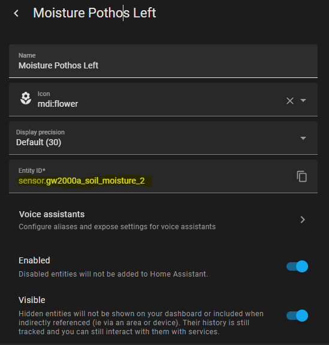

<div align="center">

# Autowatering

[](https://github.com/pre-commit/pre-commit)
[](https://black.readthedocs.io/en/stable/)
[](https://github.com/ashleve/lightning-hydra-template#license)

</div>

<br>

## 📌  Introduction

This is a simple tool that I developed to integrate the RAINPOINT WiFi Automatic Watering System for Indoor Plants (a.k.a. TTP106W wifi), which can be found at the following [link](https://www.amazon.de/-/en/gp/product/B0BCPN7HCM) and the Ecowitt Wireless Soil Moisture Sensor WH51, which can be found [here](https://www.amazon.de/-/en/gp/product/B09B3SP2BL/ref=ppx_yo_dt_b_search_asin_title?ie=UTF8&psc=1), into Home Assistant and automate the watering of my plants based on the soil moisture level. You might ask: "Why these sensors or pumps?" Well, the short answer is I started small with just a couple sensors an pumps so I thought an off the shelf solution would be fine but I found myself receiving alerts that my plants were over watered or too dry and I decided it would be easier to automate the process. In the future I might experiment with a DIY solution like the [DROPLET project](https://www.youtube.com/watch?v=mCXTqONmpZk) but for now I'm happy with the off the shelf solution.

For anyone wanting to replicate aspects of this process for their own project I'll try and document everything needed to get this working for yourself. This documentation could become out of date but it's being made November 2023. 
<br>

## Main Technologies

[Home Assistant](https://www.home-assistant.io/) - an open source home automation platform. It is able to track and control all devices at home and offer a platform for automating control. I'm using Home Assistant Core because I'm doing some higher level integrations with python but if you're new to Home Assistant, I'd suggest either created a cheap dedicated server on something like a Raspberry Pi or running the Docker container. You lose some of the flexibility but you have access to some easy to use add-ons that make it easy to get started. For example, I'm using the REST API but you could use MQTT add-on to communicate with Home Assistant.

[Ubuntu](https://ubuntu.com/) - I'm running it on Ubuntu 22.04 but I think any Linux distro would work. This code also could be run from the Home Assistant OS or on a completely different machine from the Home Assistant machine, as it's using API's for everything. I'm using Ubuntu because I run an Ubuntu server for ML projects. 

[Python](https://linuxize.com/post/how-to-install-python-on-ubuntu-22-04/) - It's a Python project so you'll need a Python distro. I'd suggest installing an newer version of python but you can always create a venv with the version of python you need. I'm using Python 3.11 for this project.
<br>

## 🚀 Setup Guide 🚀

I'm going to assume several things for this quickstart guide:
1. You have Home Assistant installed and running on a machine and that the port for Home Assistant is open to whatever machine you're running this code from. If you're running from localhost you don't need to open any ports.
2. You have a RAINPOINT WiFi Automatic Watering System for Indoor Plants (a.k.a. TTP106W wifi) and the Ecowitt Wireless Soil Moisture Sensor WH51.
3. You have a place where you can clone this repo to that has python installed.

Navigate to the folder where you want to clone this repo and run the following command:

```bash
# clone project
git clone https://github.com/natephysics/Autowatering
cd forecasting

# [OPTIONAL] create a python virtual environment for this project (recommended)
python -m venv venv
source venv/bin/activate

# install requirements
python -m pip install -r requirements.txt
```

Next we need to connect the Ecowitt Wireless Soil Moisture Sensor WH51 to Home Assistant. This is the easier of the two devices to integrate. The first step is to add the integration. 

1. Navigate to the Home Assistant UI and click on the Settings button.
2. Under the "Integrations" tab, click on the "Add Integration" button in the lower right corner.
3. Search for "Ecowitt" and click on the "Ecowitt" integration.
4. Click on the "Submit" button.

Ecowitt uses hubs (or at they call them, Weather Stations) to connect to the sensors. I'm using the GW2000A and the GW1100A, and I can confirm both will work for this. I will also note: there are complications adding two hubs to the Ecowitt Android app, namely if you have more than 8 sensors the hubs get mixed up and it doesn't correctly display each of the hubs sensors in the app. However, this is not a problem for Home Assistant and you can add as many hubs as you want and you can even add the same model hub multiple times from what I can tell. 

Now we need to add the sensors to Home Assistant. The first step will to either connect to the devices using the web interface. I found my device by looking at the connected devices on my wifi. For example, the GW2000A had a device name of GW200X/WH268X but you can also look up the MAC address in the Ecowitt app to find the device by the MAC. Once you have the IP address of the Weather Station you should be able to navigate to the device page to get a login prompt.


By default there's no password so you can just click the "Login" button. Once you're logged in you should see a page like this:


Click on the `Weather Services` button and navigate to the the `Customized` section at the bottom. You should see a page like this (without the values filled in):


Now we need to generate a API path to record the data from the Weather Station. Let's go back to Home Assistant and navigate to the `Configuration` page and click on the `Integrations` tab. Click on the `Ecowitt` integration and you should see a page like this (without the Ecowitt Devices filled in):


Click on the `Add Entry` button and when it asks `Are you sure you want to set up Ecowitt?` click `Submit`. You should see `Success!` and a page like this:


Please keep in mind that the IP address provided is what the system sees as the IP address of your home assistant. If your Home Assistant is running on a different network than the one you're running this code from, or if your Home Assistant is running in a container, you might need to determine the correct IP address. Assuming your IP address is correct, you can take the API path that was generated to the Ecowitt web interface and paste it into the `Path` section of the Ecowitt web interface, the `Port` should be the same port for Home Assistant (by default it's `8123`) and the IP address should be the one to your Home Assistant instance. `Customized` should be `Enable` and `Protocol Type Same as` should be `Ecowitt`. You can also change the `Interval` to whatever you want. I'm using 600 seconds because plants moisture and environmental conditions usually don't change on such fast scales. 


Once you save, it take take a while for the data to show up in Home Assistant. You can check the logs to see if there are any errors. If you're not seeing any errors, you can check the `Developer Tools` page and click on the `States` tab. You should see a list of all the sensors that are connected to Home Assistant. You can search for `soil_moisture` and you should see a list of all the sensors that are connected to Home Assistant. If all goes well, you should be getting sensor data from the Ecowitt sensors.

Next we need to connect to the RainPoint WiFi Automatic Watering System for Indoor Plants (a.k.a. TTP106W wifi). This is a little more complicated because the device doesn't have a web interface and it's not connected to the internet directly. The other complication is that this process won't work with the RainPoint app. Instead you need to install the Tuya app. First, make sure you have the Tuya app installed. When your ready to swtich the device between apps, remove the pump(s) from the RainPoint app (long press on the device page will give you the option to remove the device) and once removed they will automatically enter pairing mode. If you open the Tuya app it should display all the pumps that are in pairing mode. You can add the pumps to the Tuya app.

There is a Tuya integration for Home Assistant through HACS called local tuya. But this project doesn't use that because I want the script to directly control the pumps. Instead, I'm using a python library called [tinytuya](https://pypi.org/project/tinytuya/). On the Pypi page there is a detailed description of how to get the device ID and the local key. Because my devices were on a different subnet from my Home Assistant the built in scan function didn't work. I'll document the process I went through but if you're on the same subnet as your Home Assistant you should be able to use the built in scan function to find the available pumps.

First: get the device ID and local_key.

The [instructions](https://github.com/jasonacox/tinytuya/files/12101705/Tuya.IoT.API.Setup.1.pdf) on the Pypi page are pretty good. We are only interested in the PDF instructions up to the point where we link the Tuya account to the developer portal. We don't actually care about the project, we're just creating one so we can link our Tuya account to the developer portal and extract the device ID and local_key. Once you've linked your Tuya account, you can go to the [Tuya Developer Portal](https://iot.tuya.com/) and click on the `Cloud Development` tab, `Open Project`, and you want to get your `Access ID/Client ID` and `Access Secret/Client Secret`. This will allow you to download the device data which includes the local_key and device ID. 

To get the device data, we need to go back to the project folder and run a command. Go into the `Autowatering` project folder and run the following command:

```bash
source venv/bin/activate
python -m tinytuya wizard
```

Enter the `Access ID/Client ID` and `Access Secret/Client Secret` and it will request a `Device ID` from one of the devices. You can grab any of the device IDs from the `Devices` page in the project you created on the Tuya Developer Portal. 


The wizard will ask for your region, make sure it matches with the region for your project on the Tuya Developer Portal. Very importantly, it will give you an option to: `Download DP Name mappings? (Y/n):` and you want to enter `Y`. This will download a file called `tuya-raw.json` which contains the device ID and local_key we need to connect to the pumps.

One note: the IP address contained in the file will be the IP address of the device on as seen from the developer portal, so it will likely be your public IP address. But we will still need to acquire the local IP of the pump(s) and match them to the device ID and local_key.

To get the local IP addresses of the pumps you can try and an run the `Network Scanner`. Just run the following from the project directory:

```bash
python -m tinytuya scan
```

Since my devices were on a different subnet. You can also try and use the `-force` option to scan your specific subnet. 

```Usage:

    python -m tinytuya <command> [<max_time>] [-debug] [-nocolor] [-force [192.168.0.0/24 192.168.1.0/24 ...]] [-h]

      wizard         Launch Setup Wizard to get Tuya Local KEYs.
      scan           Scan local network for Tuya devices.
      devices        Scan all devices listed in devices.json file.
      snapshot       Scan devices listed in snapshot.json file.
      json           Scan devices listed in snapshot.json file [JSON].
      <max_time>     Maximum time to find Tuya devices [Default=18]
      -nocolor       Disable color text output.
      -force         Force network scan of device IP addresses based on format:
                     [net1/mask1 net2/mask2 ...] Auto-detects if none provided.
      -no-broadcasts Ignore broadcast packets when force scanning.
      -debug         Activate debug mode.
      -h             Show usage.
```

If that doesn't work, you can always brute force it. You can get the mac address of each pump from the Tuya app. Click on the device > click the pencil icon in the top right > click `Device Information` and there you should see the mac address. You can then scan a subnet that you specify for that mac address. You can match the mac address to the devices listed in your wifi router. But however you go about it, you want to get the local IP address for the pump(s) and match them to the name of the pumps. 

Once we have a list of the IP addresses and the device ID and local_key we can add them to the `plant_settings.json` file in the root directory of the project. The `plant_settings.json` file is where we will store all the settings for the plants, including the target soil moisture level, max watering time, and the PID parameters. The `plant_settings.json` file should look like this (but remove the #comments):
```json
{
    "pump_1": {
         "name": "pump_1", # this is the name of the pump
         "ip": "192.168.0.20", # local IP address of the pump
         "device_id": "xxxxxxxxxxxxxxxxxxxxxx", # from tuya-raw.json
         "local_key": "xxxxxxxxxxxxxxxxxxxxxx", # from tuya-raw.json
         "max_watering_time": 60, # the max watering time in seconds
         "target": 35, # the target soil moisture level
         "Kp": 1.0, # PID parameters (start with these and tune later)
         "Ki": 0.1,
         "Kd": 0.05,
         "integral": 0.0, # PID integral (don't change, there are updated by the script)
         "last_error": 0.0, # PID last error (don't change, there are updated by the script)
         "sensor": "sensor.gw1100a_soil_moisture_1", # this is the sensor for the soil moisture that is already registered in Home Assistant (see next step)
         "pump_sensor": "sensor.pump_1" # this is the sensor for the pump that will be created in Home Assistant (see next step))
      },
      ...(more pumps)
}
```

Now we need to match the `sensor` for each moisture sensor to each pump. For each plant, match the sensor name, for example, `sensor.gw1100a_soil_moisture_1` with the corresponding pump for the plant. You can get the sensor name from the Home Assistant home screen by clicking on the name of the sensor > pressing the setting icon in the top right and the name is listed under `Entity ID*`.  



If you don't know which sensor matches to which plant you can always pull the senor out of the soil and wait until the data updates in Home Assistant.

Next, we need to create the `pump_sensor` for each pump. This is a sensor that will be created in Home Assistant that will display the status of the pump. This is useful for debugging and for monitoring the status of the pump. The `pump_sensor` will be created in Home Assistant when the script is run. To create this sensor we need to modify the `configuration.yaml` file for Home Assistant. If you're using Home Assistant Core you can find this in the home directory of the user you've created for running Home Assistant, usually in the `.homeassistant` folder. If you're using Home Assistant OS you can find this in the `config` folder. If you're using Home Assistant Container you can find this in the `config` folder.

Open the `configuration.yaml` file and add the following to the bottom of the file:

```yaml
# Example configuration.yaml entry
# Custom Sensor
template:
  - sensor:
      - name: "Pump for plant 1" # this is the name of the pump
        unique_id: "pump_1" # this is the unique id of the pump
        state: "Unknown" # leave this line as is
      - name: "Pump for plant 2" # this is the name of the pump
        unique_id: "pump_2" # this is the unique id of the pump
        state: "Unknown" # leave this line as is
      ...(more pumps)
```
You can add as many pumps as you want. Just make sure the `unique_id` matches the name of the pump in the `plant_settings.json` file.

There is one final step before running the script. We need to connect this script to Home Assistant so that it can pull down the sensor data and record the pump run times. To do this we need to generate a `Long Lived Access Token` in Home Assistant. To do this we need to navigate to the `Profile` page in Home Assistant and at the bottom of the page you can generate a `Long-Lived Access Tokens` . Click on the `Create Token` button and give it a name. I called mine `Autowatering` but you can call it whatever you want. Once you click `OK` you be able to copy the token. Now we'll add this token to the `project_settings.json` file. 

You can copy the `project_settings_example.json` file and fill it in. If you don't currently have a Dead Man Snitch setup then just remove that section. The `project_settings.json` file should look like this:

```json
{
	"access_token": "My_very_long_access_token", # replace this with the token you generated from Home Assistant
	"snitch_url": "https://nosnch.in/mysnitchID", # remove the line if you don't plan to setup a snitch
	"home_assistant_url": "http://127.0.0.1", # this should be the local IP address of your Home Assistant instance
	"home_assistant_port": "8123" # this should be the port for your Home Assistant instance
}
```

Your home assistant needs to be accessible to the computer running the autowatering script. 

First, we can test to see if the script can connect to Home Assistant by running the following:

```bash
python src/autowatering.py --dont-water
```

If all goes well, it will connect to your Home Assistant instance, get the most recent values for you soil moisture levels, and calculate the amount of time to run the pumps to water your plants. The `--dont-water` option won't attempt to connect to the pumps so you can test the connection to Home Assistant without running the pumps. If you get an error, you can check the logs in the `logs` directory to see if there are any errors. If all goes well for each plant you should see something like this:

```log
2023-11-13 09:01:00.872 | INFO     | __main__:main:301 - Watering Plant 1 with moisture level 28.0 for 50 seconds
2023-11-13 09:01:52.284 | INFO     | __main__:water:126 - Plant 1 has been watered for 50 seconds and turned off successfully.
2023-11-13 09:01:52.288 | INFO     | __main__:main:313 - Plant Plant 2 is good with moisture level 35.0, control: 0.0
```

If that works, all that's left is to run the script. You can run the script with the following command:

```bash
python src/autowatering.py
```

This will run the script and water the plants as needed. You can run this script as a cron job or a systemd service. You can also include a Dead Man Snitch to get an email notation if the script stops running. Just include the the URL in the `project_settings.json` file.
